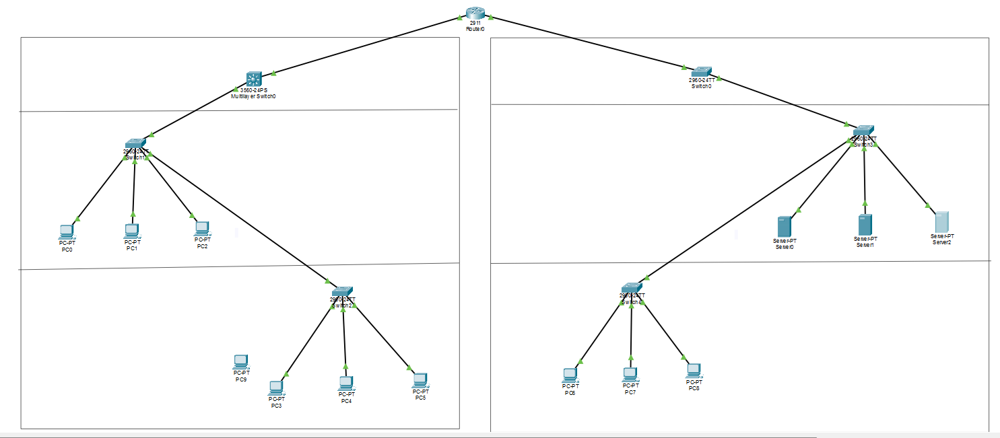

# Multi-Site Enterprise Network & Hardening Capstone

## Executive Summary
This project demonstrates the design, configuration, and security hardening of a multi-site enterprise network built using Cisco Packet Tracer. The architecture features segmented VLANs, Inter-VLAN routing via Router-on-a-Stick, centralized DHCP relay services, and multi-layered security controls across Layer 2 and Layer 3.

---

## Network Architecture & Design

### Topology Overview

The enterprise infrastructure is logically separated into distinct administrative, operational, and server subnets across two primary sites connected through a central core router (`Core-RT`).

### VLAN & IP Addressing Schema

| VLAN ID | Subnet Name | Subnet Range | Gateway IP | Description / Notes |
| :--- | :--- | :--- | :--- | :--- |
| **10** | HR Department | `10.10.10.0/24` | `10.10.10.1` | General user workstations |
| **20** | Engineering | `10.10.20.0/24` | `10.10.20.1` | Engineering staff subnets |
| **25** | R&D / Guest | `10.10.25.0/24` | `10.10.25.1` | Isolated network for research/testing |
| **30** | Database Servers | `10.10.30.0/24` | `10.10.30.1` | Protected internal application data |
| **40** | Site A Management | `10.10.40.0/24` | `10.10.40.1` | Out-of-band management & admin PCs |
| **45** | Site B Management | `10.10.45.0/24` | `10.10.45.1` | Out-of-band switch SVI management |
| **50** | Centralized Services| `10.10.50.0/24` | `10.10.50.1` | Core infrastructure (DHCP, DNS, Web) |

---

## Core Technologies & Features Implemented

1. **Inter-VLAN Routing (Router-on-a-Stick):**
   * Configured `802.1Q` sub-interfaces on `Core-RT` (`G0/0` and `G0/1`) to handle inter-departmental traffic and maintain strict gateway boundary control.

2. **Centralized DHCP Relay Services:**
   * Implemented `ip helper-address` configuration under user sub-interfaces, forwarding broadcast `DHCPDISCOVER` packets as unicast traffic to `SRV-DHCP-01` (`10.10.50.X`).

3. **Layer 2 Access Control & Hardening:**
   * **Port Security:** Configured `switchport port-security` with sticky MAC learning and `violation restrict/shutdown` modes across user-facing access ports.
   * **DHCP Snooping:** Globablly enabled DHCP Snooping, marking trunk ports and server interfaces as `trusted` to mitigate rogue DHCP server attacks and IP spoofing.

4. **Layer 3 Traffic Control (Extended ACLs):**
   * **Management Plane Hardening (ACL 100):** Restricts SSH access (TCP 22) to switch SVIs, permitting connections strictly from Management VLANs (`10.10.40.0/24` and `10.10.45.0/24`).
   * **Database Isolation (ACL 105):** Denies direct access to MySQL/Database port `TCP 3306` from general user subnets while permitting web/HTTP traffic.
   * **Departmental Segregation (ACL 110):** Blocks all IP traffic from R&D/Guest subnets (`10.10.25.0/24`) to HR subnets (`10.10.10.0/24`) at the source interface.

5. **Device Hardening & Remote Management:**
   * Generated RSA keys (`crypto key generate rsa`) and restricted VTY lines to `transport input ssh` for secure encrypted remote administration.

---

## Verification & Testing Matrix

| Test Scenario | Source Device | Target Destination | Command / Test | Result |
| :--- | :--- | :--- | :--- | :--- |
| **Authorized Management** | Admin PC (VLAN 40) | Switch SVI (`10.10.40.2`) | `ssh -l admin 10.10.40.2` | **SUCCESS** (Authenticated) |
| **Unauthorized Management**| HR PC (VLAN 10) | Switch SVI (`10.10.40.2`) | `ssh -l admin 10.10.40.2` | **BLOCKED** (ACL 100) |
| **Database Port Restriction**| HR PC (VLAN 10) | DB Server (`10.10.30.X`) | `telnet 10.10.30.X 3306` | **BLOCKED** (ACL 105) |
| **Web Service Access** | HR PC (VLAN 10) | Web Server (`10.10.30.Y`) | Web Browser (`http://...`) | **SUCCESS** (Page Loaded) |
| **R&D Isolation** | R&D PC (VLAN 25) | HR PC (VLAN 10) | `ping 10.10.10.X` | **BLOCKED** (ACL 110) |

---

## How to Run & Inspect

1. Download and install **Cisco Packet Tracer**.
2. Clone this repository or download `Enterprise_Network_Topology_Final.pkt`.
3. Open the `.pkt` file in Packet Tracer.
4. Execute `show ip access-lists` or `show ip dhcp snooping binding` on `Core-RT` and switches to inspect runtime states.
